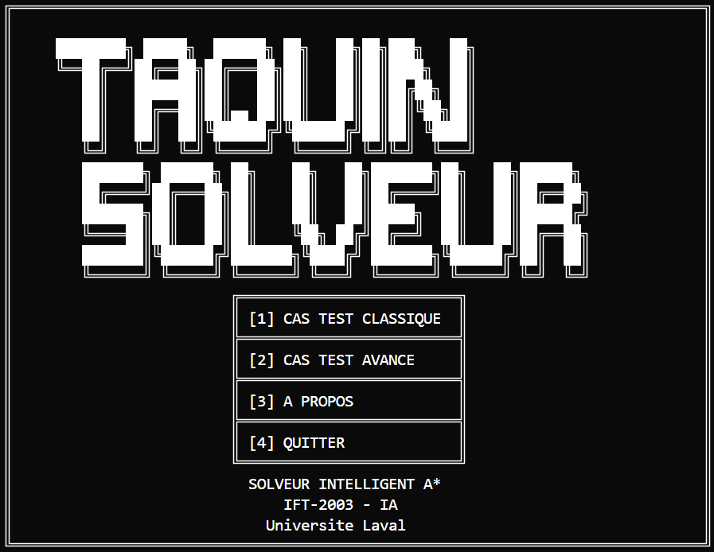

<div align="center">

# 🧩 Solveur de Taquin A*

**Solveur intelligent de puzzle 3×3 avec algorithme de recherche heuristique A***

*Projet IFT-2003 · Intelligence Artificielle 1 · Université Laval*

[](https://www.swi-prolog.org/)
[]()
[]()


</div>

---

<div align="center">

</div>

## 🚀 Installation & Lancement

### Lancement Simple (Recommandé)
```bash
# Une seule commande pour tous les systèmes :
swipl -g start run.pl
```

### Autres Commandes
```bash
# Lancement manuel (si problème avec le launcher)
swipl -g main src/main.pl

# Exécuter la suite de tests
swipl -g run_all_tests src/tests.pl
```

### Configuration Automatique
Le fichier `run.pl` configure automatiquement :
- ✅ Encodage UTF-8 pour l'affichage des caractères spéciaux
- ✅ Compatibilité Windows, macOS et Linux
- ✅ Aucune configuration manuelle requise

## 🏗️ Architecture

<table>
<tr><td><strong>Module</strong></td><td><strong>Responsabilité</strong></td></tr>
<tr><td><code>main.pl</code></td><td>🖥️ Interface CLI, orchestration, cas de test</td></tr>
<tr><td><code>game.pl</code></td><td>🎮 États du puzzle, mouvements, validation</td></tr>
<tr><td><code>astar.pl</code></td><td>🧠 Algorithme A*, heuristiques, recherche optimale</td></tr>
<tr><td><code>display.pl</code></td><td>🎨 Affichage formaté, interface utilisateur</td></tr>
</table>


## 🤖 Intelligence Artificielle

| Composante | Description | Performance |
|------------|-------------|-------------|
| **Algorithme** | A* avec closed set¹ | Optimal garanti |
| **Heuristique** | Tuiles mal placées² (excluant case vide) | Admissible + consistante |
| **État-espace** | 9!/2 = 181 440 configurations solvables | Résolution < 1 seconde |
| **Validation** | Métriques exactes cas professeur | 100% conformité académique |

### Exemple de résolution A*

<div align="center">

<br><em>Démonstration du cas test 1 avec affichage du chemin solution complet et des métriques de performance.</em>
</div>


## 🎮 Usage

### Format d'entrée
```
États : [1,2,3,5,0,6,4,7,8] (case vide = 0)
Menu  : [1] Cas test classique, [2] Cas avancé, [3] A propos, [4] Quitter
Sortie: Path A→B→C→D→E, Cost: 4, Expanded: 12
```

### Modes disponibles
- 🎯 **Cas classique** · Configuration académique standard (4 mouvements)
- 🚀 **Cas avancé** · Configuration complexe pour démonstration étendue

## 🧪 Tests

*Suite de tests automatisés : 15/15 tests passés, validation académique confirmée*

**Couverture complète :** Tests répartis sur 5 modules (game, astar, display, intégration, validation académique)

```bash
# Suite complète
swipl -g run_all_tests src/tests.pl

# Tests par module disponibles
```

## 📋 Prérequis Système

| Composant | Version | Notes |
|-----------|---------|-------|
| **SWI-Prolog** | 9.x+ | Moteur Prolog principal |
| **OS** | Windows/Linux/macOS | Multiplateforme |
| **Mémoire** | 256 MB+ | Algorithme A* avec closed set |

## 📚 Documentation Technique

| Document | Description |
|----------|-------------|
| 🏗️ [**Architecture Guide**](docs/architecture.md) | Guide technique détaillé pour l'équipe |
| 📄 [**Product Requirements**](docs/prd.md) | Spécifications et exigences du projet |
| 📝 [**Rapport de Remise**](docs/rapport_tp1.md) | Rapport final de TP1 |
| 📋 [**Énoncé Original**](archive/tp1_enonce.md) | Exigences académiques officielles |

---

<div align="center">

*🎓 Projet Universitaire · 🏛️ Université Laval · 🤖 IFT-2003 Intelligence Artificielle 1*

</div>