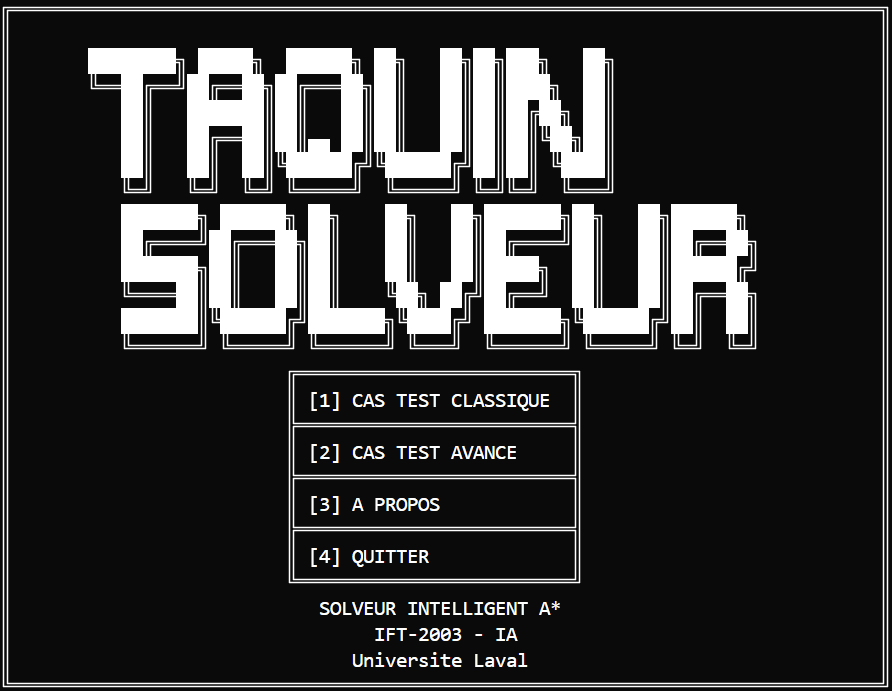

<div align="center">

# 🧩 Solveur de Taquin A*

**Solveur intelligent de puzzle 3×3 avec algorithme de recherche heuristique A***

*Projet IFT-2003 · Intelligence Artificielle 1 · Université Laval*

[](https://www.swi-prolog.org/)
[]()
[]()
[]()

</div>

---

<div align="center">

<br><em>Interface d'accueil du solveur avec menu interactif</em>
</div>

## Installation & Lancement

### Prérequis
- **SWI-Prolog 9.x+** 

| OS | Installation |
|-----|-------------|
| **Windows** | [Télécharger SWI-Prolog](https://www.swi-prolog.org/download/stable) puis installer le .exe<br>`winget install SWI-Prolog.SWI-Prolog` (avec winget) |
| **macOS** | `brew install swi-prolog` |
| **Linux** | `sudo apt install swi-prolog` (Ubuntu/Debian)<br>`sudo dnf install pl` (Fedora) |

### Lancement
```bash
swipl run.pl
```

### Tests
```bash
# Exécuter la suite de tests
swipl -g run_all_tests src/tests.pl
```


## Architecture

<table>
<tr><td><strong>Module</strong></td><td><strong>Responsabilité</strong></td></tr>
<tr><td><code>main.pl</code></td><td>🖥️ Interface CLI, orchestration, cas de test</td></tr>
<tr><td><code>game.pl</code></td><td>🎮 États du puzzle, mouvements, validation</td></tr>
<tr><td><code>astar.pl</code></td><td>🧠 Algorithme A*, heuristiques, recherche optimale</td></tr>
<tr><td><code>display.pl</code></td><td>🎨 Affichage formaté UTF-8, interface utilisateur</td></tr>
</table>


## Intelligence Artificielle

| Composante | Description | Performance |
|------------|-------------|-------------|
| **Algorithme** | A* avec closed set | Solutions optimales garanties |
| **Heuristique** | Distance Manhattan | Admissible + consistante |
| **État-espace** | 181 440 configurations solvables | Résolution < 3ms |
| **Validation** | 14 tests unitaires + 2 end-to-end | Conformité complète |

### Résultats de résolution A*

<div align="center">
<table>
<tr>
<td align="center">

<br><em>Cas test classique : Cost 4 | Expanded 12</em>
</td>
<td align="center">

<br><em>Cas test avancé : Cost 9 | Expanded 33</em>
</td>
</tr>
</table>
</div>


## Usage

### Format d'entrée
```
États : [1,2,3,5,0,6,4,7,8] (case vide = 0)
Menu  : [1] Cas test classique, [2] Cas avancé, [3] A propos, [4] Quitter
Sortie: Path A→B→C→D→E, Cost: 4, Expanded: 12
```

### Modes disponibles
- **Cas test 1** · Configuration `[1,2,3,5,0,6,4,7,8]` → Solution optimale en 4 mouvements
- **Cas test 2** · Configuration `[1,3,6,5,2,8,4,0,7]` → Solution optimale en 9 mouvements
- **Tests automatisés** · Suite complète de validation avec `swipl -g run_all_tests src/tests.pl`


## Documentation Technique

| Document | Description |
|----------|-------------|
| [**Architecture Guide**](docs/architecture.md) | Guide technique détaillé pour l'équipe |
| [**Product Requirements**](docs/prd.md) | Spécifications et exigences du projet |
| [**Rapport de Remise**](docs/rapport_tp1.md) | Rapport final de TP1 |
| [**Énoncé Original**](archive/TP1_Aut_2025%20(1).pdf) | Exigences officielles du projet |

---

<div align="center">

*Projet Universitaire · Université Laval · IFT-2003 Intelligence Artificielle 1*

</div>
