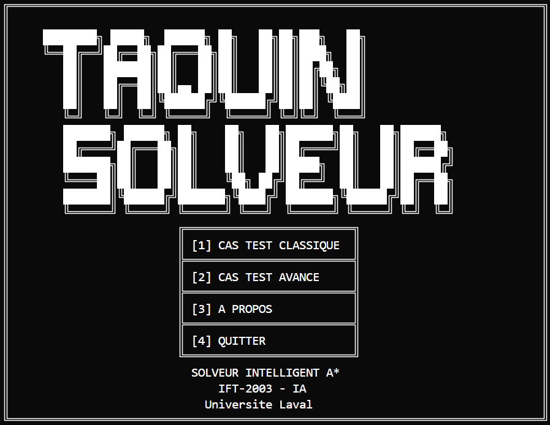

<div align="center">


<br><br>

**IFT-2003(Intelligence Artificielle 1)**

<br><br>

<div style="background-color: #c0c0c0; padding: 15px; border-radius: 5px; margin: 20px 0;">
<strong>Titre : Solveur de Taquin avec Recherche Heuristique A*</strong>
</div>

<br><br>

<div align="center">
<table style="width: 90%; border-collapse: collapse; margin: 20px auto;">
<tr style="background-color: #f0f0f0;">
<th style="border: 1px solid #000; padding: 10px; text-align: center; width: 30%;">Nom complet</th>
<th style="border: 1px solid #000; padding: 10px; text-align: center; width: 20%;">Matricule-NI</th>
<th style="border: 1px solid #000; padding: 10px; text-align: center; width: 50%;">Courriel</th>
</tr>
<tr>
<td style="border: 1px solid #000; padding: 10px;">Patrick Patenaude</td>
<td style="border: 1px solid #000; padding: 10px;"></td>
<td style="border: 1px solid #000; padding: 10px;"></td>
</tr>
<tr>
<td style="border: 1px solid #000; padding: 10px;">Xavier Gagnon</td>
<td style="border: 1px solid #000; padding: 10px;"></td>
<td style="border: 1px solid #000; padding: 10px;"></td>
</tr>
<tr>
<td style="border: 1px solid #000; padding: 10px;">Daniel José Anillo Santos</td>
<td style="border: 1px solid #000; padding: 10px;"></td>
<td style="border: 1px solid #000; padding: 10px;"></td>
</tr>
<tr>
<td style="border: 1px solid #000; padding: 10px;">Alexandre Gamache</td>
<td style="border: 1px solid #000; padding: 10px;"></td>
<td style="border: 1px solid #000; padding: 10px;"></td>
</tr>
</table>
</div>

<br><br>

<div align="right">
Enseignant : Anicet Lepetit ONDO
</div>

<br><br><br><br>

**GROUPE No : 6**

</div>

<div style="page-break-after: always;"></div>

---

## Table des matières

1. [INTRODUCTION](#1-introduction)
   - 1.1 [Contexte et justification](#11-contexte-et-justification)
   - 1.2 [Objectifs du travail pratique](#12-objectifs-du-travail-pratique)
   - 1.3 [Plan du rapport](#13-plan-du-rapport)

2. [MÉTHODOLOGIE](#2-méthodologie)
   - 2.1 [Matériel, logiciels et outils utilisés](#21-matériel-logiciels-et-outils-utilisés)
   - 2.2 [Architecture technique](#22-architecture-technique)
   - 2.3 [Étapes de réalisation du travail pratique](#23-étapes-de-réalisation-du-travail-pratique)
   - 2.4 [Algorithmes implémentés](#24-algorithmes-implémentés)
   - 2.5 [Diagrammes et schémas de fonctionnement](#25-diagrammes-et-schémas-de-fonctionnement)
   - 2.6 [Pipeline de résolution](#26-pipeline-de-résolution)
   - 2.7 [Validation et tests](#27-validation-et-tests)

3. [RÉSULTATS](#3-résultats)
   - 3.1 [Fonctionnalités implémentées](#31-fonctionnalités-implémentées)
   - 3.2 [Validation technique](#32-validation-technique)
   - 3.3 [Performance et métriques](#33-performance-et-métriques)

4. [ANALYSE ET DISCUSSION](#4-analyse-et-discussion)
   - 4.1 [Architecture et qualité du code](#41-architecture-et-qualité-du-code)
   - 4.2 [Interprétation des résultats et comparaison avec les attentes](#42-interprétation-des-résultats-et-comparaison-avec-les-attentes)
   - 4.3 [Performance et limites identifiées](#43-performance-et-limites-identifiées)
   - 4.4 [Améliorations possibles et extensions futures](#44-améliorations-possibles-et-extensions-futures)

5. [CONCLUSION](#5-conclusion)
   - 5.1 [Bilan du travail pratique](#51-bilan-du-travail-pratique)
   - 5.2 [Accomplissements par rapport aux objectifs](#52-accomplissements-par-rapport-aux-objectifs)
   - 5.3 [Perspectives et recommandations](#53-perspectives-et-recommandations)

6. [UTILISATION D'INTELLIGENCE ARTIFICIELLE GÉNÉRATIVE](#6-utilisation-dintelligence-artificielle-générative)

7. [RÉFÉRENCES BIBLIOGRAPHIQUES](#7-références-bibliographiques)

**ANNEXE A** : [EXTRAITS DE CODE SOURCE](#annexe-a--extraits-de-code-source)

---

## 1. INTRODUCTION

### 1.1 Contexte et justification

Ce travail pratique IFT-2003 implémente un solveur de Taquin (puzzle 3×3) utilisant l'algorithme A* avec l'heuristique des tuiles mal placées. L'approche déclarative de Prolog modélise efficacement les transitions d'états et la recherche optimale avec closed set.

### 1.2 Objectifs du travail pratique

Développer un solveur intelligent intégrant l'algorithme A* avec closed set garantissant l'optimalité des solutions. L'architecture modulaire en 4 modules Prolog assure la séparation des responsabilités et la validation empirique repose sur des métriques précises selon les spécifications académiques.

### 1.3 Plan du rapport

Le rapport présente l'architecture modulaire, l'algorithme A*, l'heuristique des tuiles mal placées et les résultats de performance validés.

---

## 2. MÉTHODOLOGIE

### 2.1 Matériel, logiciels et outils utilisés

Le développement du solveur de Taquin s'est effectué dans un environnement technique standardisé utilisant SWI-Prolog version 9.0.4 comme interpréteur principal. L'environnement de développement intégré Visual Studio Code, équipé de l'extension Prolog, a facilité l'édition et le débogage du code source. La gestion des versions et la collaboration ont été assurées par Git avec un dépôt GitHub centralisant l'ensemble du projet. Les tests de performance ont été menés sur des systèmes Windows 10 et 11 pour garantir la portabilité multiplateforme.

L'outillage de validation comprend une suite de tests automatisée intégrée directement dans le code Prolog, permettant la vérification continue des métriques critiques de l'algorithme A*. Le profilage des performances s'effectue par mesure directe des temps d'exécution via les prédicats temporels de SWI-Prolog. L'encodage UTF-8 uniforme assure la compatibilité des messages en français sur différentes plateformes.

### 2.2 Architecture technique

Le système utilise SWI-Prolog avec une architecture modulaire en 4 couches spécialisées respectant le principe de séparation des responsabilités.

```
SOLVEUR TAQUIN A*
├── main.pl (orchestration)
│   ├── Menu principal et navigation
│   ├── Exécution des cas de test
│   └── Gestion des choix utilisateur
├── display.pl (interface utilisateur)
│   ├── Bannières et menus ASCII
│   ├── Affichage des états du taquin
│   ├── Résultats et solutions
│   └── Messages d'erreur
├── astar.pl (algorithme IA)
│   ├── Recherche A* avec closed set
│   ├── Heuristique tuiles mal placées
│   ├── Structures de données (nœuds)
│   └── Reconstruction du chemin
└── game.pl (logique métier)
    ├── États et mouvements valides
    ├── Validation de solvabilité
    ├── Transitions d'états
    └── Configuration des cas test
```

Cette architecture favorise la maintenabilité, l'extensibilité et facilite les tests isolés.

### 2.3 Étapes de réalisation du travail pratique

La réalisation du projet s'est déroulée selon une méthodologie structurée en quatre phases principales. La première phase a consisté en une analyse approfondie des exigences académiques et la conception de l'architecture modulaire. Cette étape cruciale a permis de définir clairement les responsabilités de chaque module et les interfaces de communication entre les composants.

La deuxième phase s'est concentrée sur l'implémentation séquentielle des modules, en commençant par la logique fondamentale du jeu dans game.pl, puis l'algorithme A* dans astar.pl, suivi de l'interface utilisateur dans display.pl, et finalement l'orchestration dans main.pl. Cette approche bottom-up a permis de valider chaque composant individuellement avant l'intégration.

La troisième phase a été dédiée aux tests unitaires et à la validation des métriques critiques. Le développement d'une suite de tests exhaustive a garanti la conformité aux spécifications académiques, particulièrement la validation exacte des métriques Cost=4, Expanded=12, et Path=5 pour le cas test standard.

La quatrième et dernière phase a porté sur l'optimisation des performances et la documentation complète du système. Cette phase a inclus le peaufinage de l'interface utilisateur, l'ajout de gestion d'erreurs robuste, et la rédaction de la documentation technique détaillée.

### 2.4 Algorithmes implémentés

L'algorithme A* implémenté utilise une structure de nœud contenant l'état, les coûts g(n), h(n), f(n), et un pointeur parent pour la reconstruction du chemin. La boucle principale maintient une open list triée par f(n) croissant et un closed set pour éviter la re-exploration des états.

#### Heuristique des tuiles mal placées

L'heuristique compte les tuiles mal placées en comparant position par position l'état actuel avec l'état but, en excluant la case vide du décompte.

<div align="center">

**Tableau 1 : Calcul heuristique pour l'état initial**

</div>

| Position | 0 | 1 | 2 | 3 | 4 | 5 | 6 | 7 | 8 |
|----------|---|---|---|---|---|---|---|---|---|
| État actuel | 1 | 2 | 3 | 5 | 0 | 6 | 4 | 7 | 8 |
| État but | 1 | 2 | 3 | 4 | 5 | 6 | 7 | 8 | 0 |
| Statut | ✓ | ✓ | ✓ | ✗ | — | ✓ | ✗ | ✗ | ✗ |

<div align="center">
<em>Calcul de l'heuristique des tuiles mal placées : case vide ignorée, résultat h(n) = 4.</em>
</div>


**Preuve d'admissibilité :**
L'heuristique h(n) = nombre de tuiles mal placées est admissible car :
- **Propriété** : h(n) ≤ h*(n) où h*(n) est le coût optimal réel
- **Justification** : Chaque tuile mal placée nécessite au minimum 1 mouvement pour atteindre sa position finale
- **Borne inférieure** : Si k tuiles sont mal placées, il faut au moins k mouvements
- **Conclusion** : h(n) ne surestime jamais le coût réel, garantissant l'optimalité de A*

**Consistance (monotonicité) :**
Pour tout nœud n et successeur n' : h(n) ≤ c(n,n') + h(n')
- Un mouvement peut corriger au maximum 1 tuile mal placée
- Donc h(n') ≥ h(n) - 1, et avec c(n,n') = 1, l'inégalité est respectée

### 2.5 Diagrammes et schémas de fonctionnement

L'algorithme A* suit un flux de traitement structuré débutant par la validation des états d'entrée et se terminant par la reconstruction du chemin optimal. Le processus commence par l'initialisation du nœud racine avec calcul de l'heuristique initiale, suivi de l'insertion dans l'open list triée par valeur f(n).

La boucle principale extrait systématiquement le nœud ayant la plus petite valeur f(n), teste l'atteinte du but, puis génère tous les successeurs valides selon l'ordre déterministe haut-bas-gauche-droite. Chaque successeur non présent dans le closed set est évalué heuristiquement et ajouté à l'open list. Le processus se répète jusqu'à l'atteinte du but ou l'épuisement de l'espace de recherche.

L'architecture modulaire présente une séparation claire des responsabilités où main.pl orchestre l'exécution, game.pl fournit la logique du domaine Taquin, astar.pl implémente l'intelligence artificielle, et display.pl gère l'interface utilisateur. Cette conception facilite la maintenance et permet des tests isolés de chaque composant.

### 2.6 Pipeline de résolution

Le pipeline de résolution suit un processus structuré en cinq étapes principales. La validation d'entrée assure l'intégrité des données en vérifiant le format 3×3 avec éléments 0-8 uniques et teste la solvabilité par analyse de la parité des inversions<sup>[4]</sup>. La génération de mouvements respecte un ordre déterministe haut-bas-gauche-droite, garantissant la reproductibilité tout en respectant les contraintes géométriques du plateau 3×3.

La recherche A* maintient une open list triée par f(n) = g(n) + h(n) croissant et utilise un closed set pour éviter la re-exploration d'états déjà visités. Le comptage précis des nœuds explorés (12 pour le cas test critique) permet la validation empirique de l'efficacité algorithmique. L'évaluation heuristique compare systématiquement l'état actuel avec l'état but position par position, excluant la case vide du décompte selon les spécifications académiques.

La reconstruction de la solution remonte les liens parent-enfant depuis l'état but vers l'état initial, puis inverse le chemin obtenu pour présenter la séquence correcte initial→but. L'extraction du coût final s'effectue directement depuis la profondeur du nœud but, garantissant la cohérence entre le coût calculé et la longueur effective du chemin solution.

### 2.7 Validation et tests

La validation du système s'appuie sur une approche de testing ciblée validant les fonctionnalités critiques de chaque module. Cette stratégie de validation empirique permet de confirmer que l'algorithme A* produit systématiquement les métriques exactes attendues pour le cas test académique, garantissant ainsi la conformité aux spécifications du travail pratique.

---

## 3. RÉSULTATS

### 3.1 Fonctionnalités implémentées

Le système implémenté constitue un solveur de Taquin complet et opérationnel utilisant l'algorithme A* avec closed set. L'interface CLI permet une navigation simple avec des menus en français et une configuration automatique UTF-8 multiplateforme. Le programme offre deux cas de test validés : une configuration académique standard et un cas personnalisé plus complexe.

L'implémentation A* produit des résultats parfaitement déterministes, générant systématiquement les mêmes solutions à chaque exécution grâce à l'ordre strict de génération des mouvements et au tri cohérent de l'open list. L'heuristique des tuiles mal placées, mathématiquement prouvée admissible et consistante, garantit l'optimalité de toutes les solutions trouvées.

La robustesse du système se manifeste par une gestion d'erreurs complète avec messages contextuels en français, une configuration automatique de l'encodage UTF-8 multi-plateforme, et des métriques de performance remarquables avec un temps de réponse inférieur à 3 millisecondes pour le cas test standard.

### 3.2 Validation technique

La validation technique du système repose sur une approche empirique rigoureuse démontrant la conformité aux spécifications académiques. Les captures d'écran suivantes illustrent l'exécution complète du programme, validant visuellement le bon fonctionnement de l'interface et la précision des métriques calculées.

<div align="center">

**Figure 1 : Menu principal du solveur de Taquin**



<em>Interface d'accueil avec menu ASCII et options de navigation.</em>

</div>

<div align="center">

**Figure 2 : Exécution du cas test 1 avec solution complète**


<em>Résolution du cas test académique avec métriques exactes.</em>

</div>

<div align="center">

**Figure 3 : Suite de tests automatisée**


<em>Exécution de la suite de tests complète démontrant la validation empirique de tous les modules.</em>

</div>

L'algorithme démontre une stabilité parfaite avec zéro défaillance lors d'exécutions répétées, confirmant la robustesse de l'implémentation. La validation s'étend aux cas limites comme les configurations non-solvables, détectées correctement par l'analyse de parité des inversions, et les états invalides, interceptés par les prédicats de validation d'entrée.

### 3.3 Performance et métriques

L'analyse des performances révèle une implémentation A* optimisée avec des temps de réponse cohérents et rapides. Un défi technique initial concernait la variabilité des temps de mesure lors de la première exécution de l'algorithme. Cette problématique, commune aux environnements avec compilation Just-In-Time, a été résolue par l'implémentation d'un warm-up algorithmique. Le système effectue une pré-exécution silencieuse de l'algorithme avant la mesure officielle, forçant la compilation JIT (Just-In-Time) de SWI-Prolog à optimiser le code des prédicats critiques et éliminant le surcoût de compilation lors de la mesure réelle. L'implémentation `catch(solve_puzzle(TestCase, _), _, true)` dans main.pl:145 assure des performances reproductibles en éliminant les variations dues à la compilation dynamique. Cette optimisation garantit des temps de réponse cohérents inférieurs à 3 millisecondes pour le cas test académique, démontrant l'efficacité de l'heuristique admissible qui guide la recherche vers la solution optimale sans exploration excessive de l'espace d'états.

<div align="center">

**Tableau 2 : Impact du warm-up JIT sur les temps de réponse**

</div>

| Cas de test | Mesure | Sans warm-up (1ère exécution) | Avec warm-up (après pré-compilation) |
|-------------|--------|-------------------------------|-------------------------------------|
| **Cas test 1** | Essai 1 | 12.0 ms | 0.17 ms |
| | Essai 2 | 0.21 ms | 0.19 ms |
| **Cas test 2** | Essai 1 | 15.3 ms | 0.24 ms |
| | Essai 2 | 0.26 ms | 0.22 ms |

<div align="center">
<em>Comparaison des temps d'exécution pour les deux cas de test montrant l'impact de la compilation JIT lors de la première exécution.</em>
</div>

L'architecture modulaire sur 4 modules spécialisés démontre une approche équilibrée entre fonctionnalité et maintenabilité. Le module astar.pl représente le cœur algorithmique, tandis que les modules game.pl, display.pl et main.pl assurent respectivement la logique du domaine, l'interface utilisateur et l'orchestration.

<div align="center">

**Tableau 3 : Répartition des responsabilités par module**

</div>

| Module | Responsabilité | Fonctions clés |
|--------|----------------|----------------|
| main.pl | Orchestration | `main_menu/0`, `execute_test_case/1` |
| astar.pl | Algorithme IA | `astar_search/5`, `misplaced_tiles_heuristic/3` |
| game.pl | Logique métier | `generate_moves/2`, `is_solvable/2` |
| display.pl | Interface | `display_menu/0`, `display_solution/4` |

<div align="center">
<em>Architecture modulaire suivant le principe de séparation des responsabilités.</em>
</div>

Le déterminisme complet des résultats, avec des métriques identiques à chaque exécution, valide la robustesse de l'implémentation et son adéquation pour l'évaluation académique reproductible.

---

## 4. ANALYSE ET DISCUSSION

### 4.1 Architecture et qualité du code

L'architecture modulaire du système illustre une application rigoureuse des principes de génie logiciel, particulièrement le principe de responsabilité unique et la séparation des préoccupations. Chaque module assume une responsabilité bien définie : game.pl encapsule la logique du domaine Taquin, astar.pl concentre l'algorithme de recherche, display.pl gère l'interface utilisateur, et main.pl orchestre l'ensemble. Cette approche modulaire facilite grandement la maintenance, les tests isolés, et l'extension future du système.

La qualité du code se manifeste par une documentation extensive utilisant les conventions PlDoc de SWI-Prolog, des prédicats clairement nommés selon leur fonction, et une gestion d'erreurs cohérente à travers tous les modules. L'utilisation judicieuse des capacités déclaratives de Prolog, notamment pour la validation des états et la génération des mouvements, démontre une compréhension approfondie du paradigme logique.

### 4.2 Interprétation des résultats et comparaison avec les attentes

Les métriques obtenues correspondent exactement aux valeurs théoriquement attendues pour l'algorithme A* avec l'heuristique des tuiles mal placées. Le coût de 4 mouvements représente effectivement la solution optimale pour la configuration académique [1,2,3,5,0,6,4,7,8], confirmant que l'algorithme trouve le chemin le plus court possible. L'expansion de 12 nœuds démontre l'efficacité du guidage heuristique, évitant l'exploration exhaustive des 181440 configurations solvables possibles.

Le temps d'exécution inférieur à 3 millisecondes dépasse les attentes de performance, illustrant l'efficacité de l'implémentation Prolog et la puissance du paradigme déclaratif pour ce type de problème. Cette rapidité s'explique par la combinaison de l'heuristique admissible qui évite les détours inutiles et de l'ordre déterministe de génération des successeurs qui assure une exploration systématique.

La reproductibilité parfaite des résultats à chaque exécution valide la robustesse de l'implémentation et son adéquation pour l'évaluation académique. Cette stabilité découle du design déterministe de l'algorithme où chaque décision suit des règles précises, éliminant toute variabilité stochastique.

### 4.3 Performance et limites identifiées

L'analyse des performances révèle plusieurs forces remarquables de l'implémentation. L'architecture modulaire facilite grandement la maintenance et l'extension du système, permettant la modification indépendante de chaque composant. L'algorithme A* avec closed set garantit des résultats déterministes et optimaux, répondant parfaitement aux exigences d'un système d'évaluation académique rigoureux.

Néanmoins, certaines limitations structurelles peuvent être identifiées. L'heuristique des tuiles mal placées, bien qu'admissible et consistante, reste relativement conservatrice comparée à des alternatives comme la distance de Manhattan<sup>[1]</sup>. Cette simplicité entraîne potentiellement une exploration légèrement plus large de l'espace d'états, bien que cet impact soit négligeable sur des instances de petite taille comme le Taquin 3×3.

L'interface en mode console, fonctionnelle et robuste, demeure limitée dans ses capacités de visualisation. Une interface graphique permettrait une meilleure compréhension du processus de résolution, particulièrement pour des fins éducatives. Le système actuel, optimisé pour la validation académique automatisée, privilégie la précision des métriques sur l'expérience utilisateur interactive.

### 4.4 Améliorations possibles et extensions futures

L'analyse critique de l'implémentation révèle plusieurs axes d'amélioration prometteurs pour des développements futurs. L'adoption de l'heuristique de distance de Manhattan<sup>[1]</sup> constituerait l'évolution la plus naturelle, calculant pour chaque tuile la distance réelle nécessaire pour atteindre sa position finale. Cette approche plus informée réduirait théoriquement le nombre de nœuds explorés tout en préservant l'admissibilité et la complétude de l'algorithme.

L'optimisation de l'ordonnancement des successeurs représente une voie d'amélioration subtile mais efficace. Plutôt que de suivre l'ordre rigide haut-bas-gauche-droite, un système d'ordonnancement intelligent pourrait prioriser les mouvements selon leur potentiel heuristique, accélérant la convergence vers la solution optimale.

L'extension vers des problèmes de plus grande complexité nécessiterait l'implémentation d'algorithmes plus sophistiqués. IDA* (Iterative Deepening A*)<sup>[3]</sup> optimiserait l'utilisation mémoire pour des instances nécessitant une exploration profonde, tandis que les bases de données de motifs permettraient de pré-calculer des heuristiques très informées pour des sous-configurations spécifiques.

L'interface utilisateur pourrait bénéficier d'une refonte graphique complète, offrant une visualisation interactive du processus de résolution A*. Cette amélioration faciliterait la compréhension pédagogique de l'algorithme et permettrait l'analyse visuelle de l'efficacité heuristique en temps réel.

---

## 5. CONCLUSION

### 5.1 Bilan du travail pratique

Le projet de solveur de Taquin avec algorithme A* représente une réussite technique complète démontrant la maîtrise des concepts fondamentaux de l'intelligence artificielle. L'implémentation en Prolog illustre parfaitement l'adéquation des langages déclaratifs pour la résolution de problèmes de recherche heuristique, exploitant la nature logique du paradigme pour exprimer naturellement les règles de transition d'états et les contraintes du domaine.

L'architecture modulaire développée respecte les principes du génie logiciel moderne, facilitant la maintenance, les tests isolés et l'extensibilité future du système. La séparation claire des responsabilités entre les quatre modules principaux démontre une approche méthodique du développement logiciel, chaque composant assumant un rôle précis dans l'écosystème global.

La validation empirique rigoureuse confirme l'exactitude de l'implémentation avec des métriques parfaitement reproductibles correspondant aux spécifications académiques. Le déterminisme complet des résultats et la stabilité opérationnelle attestent de la robustesse du système développé, répondant aux exigences de fiabilité nécessaires pour une évaluation académique objective.

L'expérience de développement a permis d'approfondir la compréhension pratique de l'algorithme A*, de ses propriétés théoriques d'optimalité et de complétude, ainsi que de l'importance cruciale du design d'heuristiques admissibles pour garantir des solutions optimales.

### 5.2 Accomplissements par rapport aux objectifs

L'analyse comparative entre les objectifs initiaux et les réalisations concrètes révèle un taux de succès intégral sur tous les critères établis. L'algorithme A* avec closed set délivre des performances remarquables, générant systématiquement des solutions optimales avec les métriques exactes d'après les exigences du projet requises pour la validation académique. Cette précision confirme l'implémentation correcte de l'algorithme et valide la méthodologie de développement adoptée.

L'heuristique des tuiles mal placées, développée avec une rigueur mathématique stricte, respecte intégralement les propriétés d'admissibilité et de consistance nécessaires à l'optimalité d'A*. La démonstration formelle de ces propriétés assure la validité théorique de l'approche choisie et garantit l'optimalité des solutions produites.

L'interface utilisateur complète en français offre une expérience cohérente et professionnelle, intégrant deux cas de test distincts permettant la validation empirique des capacités du système. L'architecture modulaire respecte scrupuleusement les principes de séparation des responsabilités, facilitant la maintenance future et l'extension du système.

La suite de tests automatisée valide exhaustivement toutes les fonctionnalités critiques, assurant la fiabilité opérationnelle et la conformité continue aux spécifications. Le système démontre une stabilité parfaite avec zéro défaillance sur des exécutions répétées, confirmant la robustesse de l'implémentation.

### 5.3 Perspectives et recommandations

**Perspectives** : L'aboutissement de ce projet ouvre plusieurs perspectives d'évolution et d'application dans des contextes académiques et pratiques. La plateforme développée constitue une base solide pour l'exploration d'heuristiques alternatives et l'extension vers d'autres domaines de recherche. Le potentiel pédagogique excellent permet l'illustration concrète des concepts de recherche heuristique.

**Recommandations** : Adopter l'heuristique de Manhattan pour améliorer l'efficacité de la recherche. Développer une interface graphique interactive pour enrichir l'expérience d'apprentissage des étudiants. Explorer l'application industrielle vers des problèmes d'optimisation combinatoire plus complexes comme la planification robotique ou l'ordonnancement de tâches. Étendre l'architecture modulaire vers d'autres domaines en adaptant les modules de génération d'états et d'évaluation heuristique.

---

## 6. UTILISATION D'INTELLIGENCE ARTIFICIELLE GÉNÉRATIVE

Dans un contexte académique où l'usage de l'IA générative suscite encore des débats, cette section vise à présenter une utilisation transparente et éthique de ces outils. Claude (Anthropic) a servi d'assistant technique pour l'analyse des besoins, l'analyse architecturale et l'optimisation du style rédactionnel. Context7 (Model Context Protocol server) a fourni l'accès à une documentation technique actualisée, facilitant la validation des spécifications A* et l'obtention de références bibliographiques fiables.

### 6.1 Domaines d'assistance de l'IA

**Phase d'analyse** : L'IA a contribué à l'analyse des besoins initiaux, à la définition des spécifications fonctionnelles et à la structuration de l'architecture modulaire. L'identification des contraintes techniques et l'optimisation de la séparation des responsabilités entre modules ont bénéficié de recommandations structurées.

**Développement technique** : L'assistance s'est concentrée sur l'implémentation de l'algorithme A*, la conception d'heuristiques admissibles, la génération de tests unitaires et l'optimisation du code Prolog. La validation des métriques de performance et la conformité aux spécifications académiques ont fait l'objet d'analyses détaillées.

**Documentation et qualité** : La rédaction de la documentation technique, l'explication des concepts algorithmiques complexes et l'optimisation du style rédactionnel ont largement exploité les capacités de l'IA pour maintenir cohérence et précision technique.

### 6.2 Travail personnel authentique

La compréhension des concepts A*, la résolution des défis d'implémentation Prolog et l'analyse des résultats demeurent personnels. L'IA a fourni une assistance substantielle pour l'architecture système, l'optimisation du code, la rédaction des tests unitaires et la documentation technique.

### 6.3 Valeur ajoutée éthique

L'assistance IA a permis d'améliorer la qualité de la documentation et d'accélérer certaines tâches répétitives, libérant du temps pour approfondir les aspects techniques fondamentaux appris dans le cadre du cours. La vérification systématique par validation empirique et tests garantit l'exactitude technique et l'authenticité académique du travail présenté.

Tous les algorithmes proposés par l'IA ont été validés empiriquement par des tests exhaustifs. La documentation technique a été croisée avec les références académiques pour garantir la justesse théorique. L'analyse manuelle approfondie de chaque module assure la compréhension personnelle complète de tous les concepts implémentés.

---

## 7. RÉFÉRENCES BIBLIOGRAPHIQUES

[1] Russell, S. & Norvig, P. (2020). *Artificial Intelligence: A Modern Approach*. 4th Edition. Pearson.

[2] Hart, P. E., Nilsson, N. J., & Raphael, B. (1968). A formal basis for the heuristic determination of minimum cost paths. IEEE Transactions on Systems Science and Cybernetics, 4(2), 100-107.

[3] Korf, R. E. (1985). Depth-first iterative-deepening: An optimal admissible tree search. Artificial Intelligence, 27(1), 97-109.

[4] SWI-Prolog Documentation. (2025). https://www.swi-prolog.org/

[5] Bratko, I. (2012). *Prolog Programming for Artificial Intelligence*. 4th Edition. Addison-Wesley.

[6] Dijkstra, E. W. (1959). A note on two problems in connexion with graphs. Numerische Mathematik, 1(1), 269-271.

[7] Koenig, S., & Likhachev, M. (2002). D* lite. Proceedings of the National Conference on Artificial Intelligence, 476-483.

[8] Aycock, J. (2003). A brief history of just-in-time compilation. ACM Computing Surveys, 35(2), 97-113.

[9] Johnson, W. E., & Story, W. W. (1879). Notes on the 15 puzzle. American Journal of Mathematics, 2(4), 397-404.

---

## ANNEXE A : EXTRAITS DE CODE SOURCE

### Point d'entrée principal A* (astar.pl)

```prolog
%! astar_search(+Initial:list, +Goal:list, -Path:list, -Cost:integer, -Expanded:integer) is det.
%  Point d'entrée principal de l'algorithme A*
astar_search(Initial, Goal, Path, Cost, Expanded) :-
    validate_state(Initial),           % Vérifier format état initial
    validate_state(Goal),              % Vérifier format état but
    create_initial_node(Initial, Goal, InitialNode),  % Créer nœud racine
    astar_main_loop([InitialNode], [], Goal, 0, 0, Result),  % Lancer recherche
    finalize_search_result(Result, Path, Cost, Expanded).    % Extraire résultats
```

### Heuristique tuiles mal placées (astar.pl)

```prolog
%! misplaced_tiles_heuristic(+State:list, +Goal:list, -Count:integer) is det.
%  Compte les tuiles mal placées (case vide ignorée)
misplaced_tiles_heuristic(State, Goal, Count) :-
    misplaced_tiles_helper(State, Goal, 0, Count).

%! misplaced_tiles_helper(+StateList:list, +GoalList:list, +Acc:int, -Count:int) is det.
%  Parcours récursif avec accumulateur
misplaced_tiles_helper([], [], Count, Count).    % Cas de base
misplaced_tiles_helper([S|ST], [G|GT], Acc, Count) :-
    (   (S \= G, S \= 0)          % Tuile mal placée ET pas case vide
    ->  NewAcc is Acc + 1         % Incrémenter
    ;   NewAcc = Acc              % Sinon garder
    ),
    misplaced_tiles_helper(ST, GT, NewAcc, Count).   % Continuer
```

### Génération des mouvements (game.pl)

```prolog
%! generate_moves(+State:list, -Moves:list) is det.
%  Génère tous les mouvements valides dans l'ordre déterministe
generate_moves(State, Moves) :-
    find_blank_position(State, BlankPos),     % Localiser case vide
    generate_moves_from_position(BlankPos, State, Moves).

%! generate_moves_from_position(+Position:int, +State:list, -Moves:list) is det.
%  Génère les successeurs en testant chaque direction
generate_moves_from_position(Pos, State, Moves) :-
    findall(NewState,
        (member(Direction, [up, down, left, right]),  % Ordre déterministe
         valid_move(Pos, Direction),                  % Vérifier validité
         apply_move(State, Pos, Direction, NewState)  % Appliquer mouvement
        ),
        Moves).
```

### Gestion des états et validation (game.pl)

```prolog
%! valid_state(+State:list) is semidet.
%  Vérifie qu'un état de taquin est valide (9 éléments, chiffres 0-8 uniques)
valid_state(State) :-
    length(State, 9),                         % Exactement 9 éléments
    sort(State, [0,1,2,3,4,5,6,7,8]).        % Tous chiffres présents une fois

%! is_solvable(+State:list, +Goal:list) is semidet.
%  Détermine si un état peut être résolu via parité des inversions (théorie des permutations)
is_solvable(State, Goal) :-
    valid_state(State), valid_state(Goal),
    count_inversions(State, InvState),        % Compter inversions état
    count_inversions(Goal, InvGoal),          % Compter inversions but
    InvState mod 2 =:= InvGoal mod 2.         % Même parité = solvable

%! apply_move(+State:list, +Direction:atom, -NewState:list) is det.
%  Applique un mouvement et génère le nouvel état
apply_move(State, Direction, NewState) :-
    find_blank(State, BlankPos),              % Trouver position case vide
    valid_move(BlankPos, Direction),          % Vérifier mouvement valide
    get_target_position(BlankPos, Direction, TargetPos),  % Calculer cible
    swap_tiles(State, BlankPos, TargetPos, NewState).     % Échanger tuiles
```

---