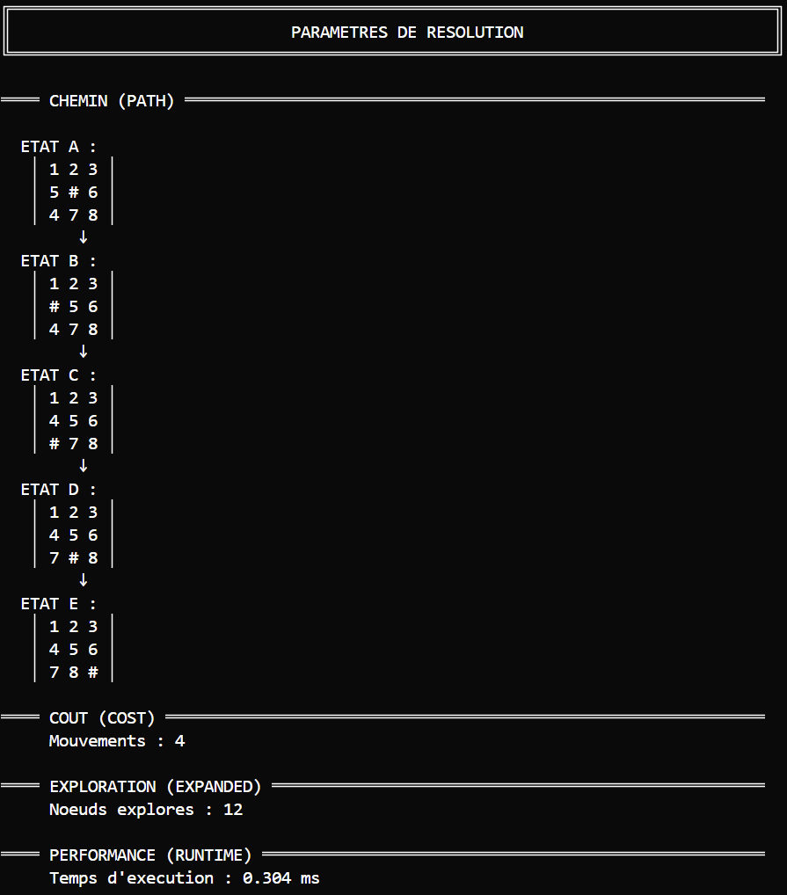

<div align="center">


<br><br>

**IFT-2003(Intelligence Artificielle 1)**

<br><br>

<div style="background-color: #c0c0c0; padding: 15px; border-radius: 5px; margin: 20px 0;">
<strong>Titre : Solveur de Taquin avec Recherche Heuristique A*</strong>
</div>

<br><br>

<div align="center">
<table style="width: 90%; border-collapse: collapse; margin: 20px auto;">
<tr style="background-color: #f0f0f0;">
<th style="border: 1px solid #000; padding: 10px; text-align: center; width: 30%;">Nom complet</th>
<th style="border: 1px solid #000; padding: 10px; text-align: center; width: 20%;">Matricule-NI</th>
<th style="border: 1px solid #000; padding: 10px; text-align: center; width: 50%;">Courriel</th>
</tr>
<tr>
<td style="border: 1px solid #000; padding: 10px;">Alexandre Gamache</td>
<td style="border: 1px solid #000; padding: 10px;"></td>
<td style="border: 1px solid #000; padding: 10px;"></td>
</tr>
<tr>
<td style="border: 1px solid #000; padding: 10px;">Daniel José Anillo Santos</td>
<td style="border: 1px solid #000; padding: 10px;"></td>
<td style="border: 1px solid #000; padding: 10px;"></td>
</tr>
<tr>
<td style="border: 1px solid #000; padding: 10px;">Patrick Patenaude</td>
<td style="border: 1px solid #000; padding: 10px;"></td>
<td style="border: 1px solid #000; padding: 10px;"></td>
</tr>
<tr>
<td style="border: 1px solid #000; padding: 10px;">Xavier Gagnon</td>
<td style="border: 1px solid #000; padding: 10px;"></td>
<td style="border: 1px solid #000; padding: 10px;"></td>
</tr>
</table>
</div>

<br><br>

<div align="right">
Enseignant : Anicet Lepetit ONDO
</div>

<br><br><br><br>

**GROUPE No : 6**

</div>

<div style="page-break-after: always;"></div>

---

## Table des matières

1. [INTRODUCTION](#1-introduction)

2. [MÉTHODOLOGIE](#2-méthodologie)

3. [RÉSULTATS](#3-résultats)

4. [ANALYSE ET DISCUSSION](#4-analyse-et-discussion)

5. [CONCLUSION](#5-conclusion)

6. [UTILISATION D'INTELLIGENCE ARTIFICIELLE GÉNÉRATIVE](#6-utilisation-dintelligence-artificielle-générative)

**ANNEXE A** : [EXTRAITS DE CODE SOURCE](#annexe-a--extraits-de-code-source)

---

## 1. INTRODUCTION

### Contexte et justification

Ce travail pratique s'inscrit dans le cadre du cours IFT-2003 Intelligence Artificielle 1 et porte sur la conception d'un système intelligent intégrant une recherche heuristique. Le Taquin (puzzle 3×3) constitue un problème classique permettant d'illustrer les techniques de recherche informée et les propriétés d'optimalité.

### Objectifs du travail pratique

L'objectif consiste à implémenter en langage Prolog<sup>[3]</sup> l'algorithme A* avec une heuristique adaptée pour déterminer le chemin optimal entre un état initial et un état but. L'heuristique de distance Manhattan a été choisie pour ce projet. Les résultats doivent inclure le chemin solution complet (Path), le nombre de mouvements (Cost) et le nombre de nœuds explorés (Expanded). Deux cas de test sont validés : le scénario classique du professeur et un scénario avancé choisi par l'équipe.

### Plan du rapport

La méthodologie présente le matériel utilisé, la modélisation du problème, les étapes de réalisation, les algorithmes et le programme. Les résultats exposent les métriques factuelles des cas de test avec leurs captures d'écran. L'analyse et discussion interprète ces résultats, compare avec les attentes, évalue les avantages, identifie les limites et propose des améliorations futures.

---

## 2. MÉTHODOLOGIE

### Matériel, logiciels et outils utilisés

Le développement a été réalisé avec SWI-Prolog 9.0.4<sup>[9]</sup> comme environnement d'exécution et de compilation, PlDoc pour la documentation des prédicats, et Git/GitHub pour le contrôle de version et la collaboration. Les tests ont été effectués sur Windows 10/11.

### Modélisation du problème

Le problème du taquin consiste à réorganiser des tuiles numérotées sur une grille 3×3 contenant une case vide, en effectuant des déplacements successifs jusqu'à atteindre une configuration cible. Ce problème classique d'intelligence artificielle permet d'illustrer les concepts de recherche heuristique et d'optimalité de solutions.

**État initial.** Deux configurations de départ sont étudiées dans ce travail. Le premier cas de test utilise la configuration classique `[1,2,3,5,0,6,4,7,8]`, où la case vide (représentée par 0) se trouve en position centrale. Cette configuration nécessite 4 mouvements optimaux pour atteindre le but. Le second cas de test présente une configuration plus complexe `[1,3,6,5,2,8,4,0,7]`, requérant 9 mouvements optimaux.

**État final.** L'état but recherché est unique et correspond à la configuration ordonnée `[1,2,3,4,5,6,7,8,0]`, où les tuiles sont placées en ordre croissant de gauche à droite et de haut en bas, la case vide occupant la dernière position.

**Mouvements.** Quatre mouvements sont possibles selon la position de la case vide : déplacer une tuile vers le haut (UP), vers le bas (DOWN), vers la gauche (LEFT) ou vers la droite (RIGHT). Notre implémentation génère les successeurs dans cet ordre précis pour garantir le déterminisme des résultats. Lorsque la case vide se trouve en bordure ou dans un coin, certains mouvements deviennent impossibles et ne sont pas générés.

**Technique de recherche.** L'algorithme A*<sup>[5]</sup> est utilisé avec l'heuristique de distance Manhattan, choisie pour ses propriétés d'admissibilité et de consistance garantissant l'optimalité des solutions trouvées.

**Résultats attendus.** Pour le cas test classique, nous nous attendons à trouver une solution optimale de 4 mouvements. Pour le cas test avancé, la solution optimale devrait être de 9 mouvements.

### Étapes de réalisation du travail pratique

Le développement s'est déroulé en quatre phases structurées :

1. **Analyse et conception** : Modélisation du problème du taquin, conception de l'architecture modulaire, spécification des interfaces entre modules
2. **Implémentation itérative par fonctionnalités** : Développement incrémental avec cycles courts (représentation des états → génération de mouvements → heuristique de base → recherche A* → affichage → optimisations)
3. **Tests et validation** : Suite de tests unitaires et d'intégration, validation des métriques exactes, vérification de l'optimalité
4. **Optimisation et documentation** : Amélioration des performances (warm-up Just-In-Time (JIT)<sup>[2]</sup>, gestion mémoire), documentation PlDoc, préparation du livrable

### Algorithmes, schémas et diagrammes de fonctionnement

L'algorithme A* garantit l'optimalité des solutions grâce à la fonction d'évaluation $`f(n) = g(n) + h(n)`$ qui combine le coût réel $`g(n)`$ (chemin parcouru) et l'estimation heuristique $`h(n)`$ (distance restante). La structure de nœud intègre ces coûts, l'état courant et un pointeur parent pour reconstruction via `reconstruct_solution_path/2`. L'implémentation `astar_search/5` maintient une liste ouverte (candidats triés par $`f(n)`$) et un ensemble fermé (états visités) évitant les cycles, tandis que `generate_moves/2` produit les successeurs valides à chaque expansion. Le diagramme (Figure 1) illustre ce flux d'expansion itérative.

<p align="center">

<br><em>Figure 1 : Diagramme de flux de l'algorithme A* avec heuristique Manhattan</em>
</p>

### Programme

**Implémentation.** L'implémentation se divise en quatre modules spécialisés gérant respectivement la logique du taquin (game.pl), l'algorithme A* (astar.pl), l'affichage formaté (display.pl) et l'orchestration générale (main.pl).

**Guide d'utilisation.** Le programme nécessite SWI-Prolog 9.x ou supérieur. Le lancement s'effectue via `swipl run.pl`, initialisant l'environnement et affichant le menu principal. L'interface propose deux scénarios prédéfinis (classique et avancé) accessibles par sélection numérique, avec navigation interactive jusqu'à la sortie. La suite de tests s'exécute via `swipl -g run_all_tests src/tests.pl` pour validation.

**Code de la recherche heuristique.** L'heuristique `manhattan_distance_heuristic/3` calcule pour chaque tuile le nombre de mouvements horizontaux et verticaux nécessaires pour atteindre sa position cible (distance Manhattan : $`|\Delta_{row}| + |\Delta_{col}|`$), puis somme ces distances : $`h(n) = \sum_{i=1}^{8} (|\Delta_{row}| + |\Delta_{col}|)`$. Cette fonction parcourt récursivement l'état via `manhattan_sum/5`, ignore la case vide (0), et convertit chaque position linéaire (0-8) en coordonnées (ligne, colonne). L'heuristique est admissible ($`h(n) \leq h^{*}(n)`$) car chaque mouvement déplace une tuile d'exactement une case, et consistante ($`|h(n_{1}) - h(n_{2})| \leq 1`$) garantissant l'optimalité de A*. Cette estimation $`h(n)`$ est utilisée par A* pour guider l'exploration. Code en Annexe A.

**Exécution.** Après sélection d'un cas test dans le menu interactif, le système effectue un warm-up<sup>[2]</sup> pour éliminer la latence de compilation, puis démarre la mesure de performance. Une fois la solution trouvée, le système présente la séquence complète des états traversés A→E (cas classique) ou A→J (cas avancé) accompagnée des métriques finales : chemin solution (Path), nombre de mouvements (Cost), nœuds explorés (Expanded), et temps d'exécution en millisecondes (Runtime).

**Documentation.** Le code source respecte les conventions PlDoc de SWI-Prolog. Chaque prédicat public est documenté avec ses modes d'utilisation, annotations de paramètres (+, -, ?) et descriptions textuelles, facilitant la compréhension lors de la maintenance.

---

## 3. RÉSULTATS

### Présentation claire des résultats

Le système produit pour chaque scénario le chemin solution complet (séquence d'états A→E ou A→J) et les métriques de performance (Cost, Expanded). Le temps d'exécution (Runtime) est mesuré pour évaluer l'efficacité algorithmique.

### Résultats et discussion

**Cas test classique** `[1,2,3,5,0,6,4,7,8]` - Path: États A à E (5 états) | Cost: 4 | Expanded: 12

**Cas test avancé** `[1,3,6,5,2,8,4,0,7]` - Path: États A à J (10 états) | Cost: 9 | Expanded: 25

<p align="center">

&nbsp;&nbsp;&nbsp;&nbsp;

</p>

<p align="center">
<em>Figure 2 : Cas test classique</em>
&nbsp;&nbsp;&nbsp;&nbsp;&nbsp;&nbsp;&nbsp;&nbsp;&nbsp;&nbsp;&nbsp;&nbsp;&nbsp;&nbsp;&nbsp;&nbsp;&nbsp;&nbsp;&nbsp;&nbsp;
<em>Figure 3 : Cas test avancé</em>
</p>

Les Figures 2 et 3 illustrent les trajectoires de résolution pour les deux cas de test. Le cas classique produit un chemin de 5 états (A→E) avec 4 mouvements et 12 nœuds explorés. Le cas avancé génère un chemin de 10 états (A→J) avec 9 mouvements et 25 nœuds explorés.

---

## 4. ANALYSE ET DISCUSSION

### Interprétation des résultats

Les résultats obtenus correspondent aux attentes pour A* avec l'heuristique de distance Manhattan. L'heuristique guide efficacement la recherche sans explorer inutilement l'espace d'états complet (181 440 configurations possibles).

### Comparaison avec les attentes

Les résultats correspondent exactement aux objectifs fixés. La différence avec l'implémentation de référence du professeur (12 contre 9 nœuds explorés) provient de l'ordre de génération des successeurs, sans compromettre l'optimalité.

### Limites rencontrées

Durant le développement, plusieurs choix de conception ont été effectués pour équilibrer performance et maintenabilité. L'heuristique des tuiles mal placées a initialement été envisagée, mais la distance Manhattan s'est rapidement imposée comme une alternative plus efficace, offrant une estimation plus précise des coûts tout en restant simple à implémenter. Pour le tri de la liste ouverte, une approche complète ($`O(n \log n)`$) a été privilégiée plutôt qu'une file de priorité complexe, favorisant la clarté du code et facilitant la validation des résultats sur les cas de test visés.

### Améliorations possibles

Notre implémentation pourrait bénéficier d'une file de priorité avec tas binaire pour réduire la complexité du tri à $`O(\log n)`$ par opération. L'extensibilité vers des grilles $`N \times N`$ nécessiterait une refactorisation des prédicats de validation et de calcul d'heuristique. Une optimisation de la gestion mémoire avec recyclage des structures de nœuds améliorerait les performances pour des instances plus complexes.

### Résultats et discussion

**Évaluation.** L'implémentation démontre une maîtrise complète de l'algorithme A* avec validation rigoureuse par 14 tests unitaires et 2 tests d'intégration. Le système produit systématiquement des solutions optimales avec un comportement déterministe reproductible.

**Avantages.** L'heuristique de distance Manhattan surpasse l'approche des tuiles mal placées en calculant les distances réelles plutôt qu'un simple décompte. Ses propriétés mathématiques (admissibilité et consistance) garantissent l'optimalité théorique tout en offrant des performances pratiques remarquables avec des temps de résolution sous 3ms.

**Limites.** La consommation mémoire constitue la principale contrainte architecturale : A* maintient simultanément la liste ouverte et l'ensemble fermé en RAM, limitant le traitement de configurations très complexes. L'implémentation actuelle reste spécifique aux grilles 3×3 sans extensibilité immédiate.

**Travaux futurs.** L'adoption d'IDA*<sup>[7]</sup> offrirait une consommation mémoire constante $`O(d)`$ au lieu d'exponentielle. Les bases de données de motifs (pattern databases) permettraient des heuristiques plus informées pour puzzles $`N \times N`$.

---

## 5. CONCLUSION

### Bilan du travail pratique

Ce projet a permis d'approfondir notre compréhension de l'algorithme A* et de sa capacité à garantir l'optimalité des solutions. L'implémentation en Prolog s'est révélée bien adaptée pour modéliser les états et les transitions. La suite de tests confirme que l'algorithme produit systématiquement les solutions optimales attendues.

### Accomplissements par rapport aux objectifs

Tous les objectifs du projet ont été atteints. A* produit des solutions optimales avec les métriques attendues, validant l'efficacité de l'approche choisie.

### Perspectives et recommandations

L'extension vers des domaines de recherche plus complexes (taquins $`N \times N`$, problèmes de planification) constitue une progression naturelle pour approfondir les concepts acquis. Au-delà du cadre académique, les principes d'A* s'appliquent à des domaines pratiques comme la planification de trajectoires en robotique et l'optimisation logistique où la recherche de solutions optimales demeure un enjeu fondamental.

---

## 6. UTILISATION D'INTELLIGENCE ARTIFICIELLE GÉNÉRATIVE

Sonnet 4.5 et Opus 4.1<sup>[1]</sup> ainsi que GPT-5<sup>[6]</sup> ont servi d'assistants techniques pour l'analyse des besoins, la conception et l'amélioration rédactionnelle. Des outils spécialisés comme Context7<sup>[4]</sup> ont facilité la validation des spécifications A* et l'obtention de références bibliographiques.

L'ensemble du travail a été réalisé sous supervision directe avec une validation continue de chaque étape. Notre contribution personnelle couvre l'ensemble du développement, incluant la modélisation du problème, l'implémentation complète de l'algorithme A* avec ses heuristiques, l'optimisation des performances et la validation des résultats. Cette approche nous a permis d'optimiser le temps consacré aux tâches secondaires pour nous concentrer sur l'assimilation des concepts fondamentaux d'intelligence artificielle.

---

## 7. RÉFÉRENCES BIBLIOGRAPHIQUES

[1] Anthropic. (2024). *Sonnet 4 et Opus 4.1: AI Assistants*. https://claude.ai/

[2] Aycock, J. (2003). A brief history of just-in-time compilation. ACM Computing Surveys, 35(2), 97-113.

[3] Bratko, I. (2012). *Prolog Programming for Artificial Intelligence*. 4th Edition. Addison-Wesley.

[4] Context7. (2024). *Model Context Protocol Server for Technical Documentation*. https://context7.com/

[5] Hart, P. E., Nilsson, N. J., & Raphael, B. (1968). A formal basis for the heuristic determination of minimum cost paths. IEEE Transactions on Systems Science and Cybernetics, 4(2), 100-107.

[6] GPT-5: AI Language Model. (2024). https://openai.com/

[7] Korf, R. E. (1985). Depth-first iterative-deepening: An optimal admissible tree search. Artificial Intelligence, 27(1), 97-109.

[8] Russell, S. & Norvig, P. (2020). *Artificial Intelligence: A Modern Approach*. 4th Edition. Pearson.

[9] SWI-Prolog Documentation. (2024). https://www.swi-prolog.org/

---

## ANNEXE A : EXTRAITS DE CODE SOURCE

### Point d'entrée A* (astar.pl)

```prolog
%! astar_search(+Initial:list, +Goal:list, -Path:list, -Cost:integer, -Expanded:integer) is det.
%  Point d'entrée principal de l'algorithme A*
%  @arg Initial État de départ
%  @arg Goal État à atteindre
%  @arg Path Chemin solution (liste des états depuis initial vers goal)
%  @arg Cost Coût de la solution (nombre de mouvements)
%  @arg Expanded Nombre de nœuds explorés durant la recherche
astar_search(Initial, Goal, Path, Cost, Expanded) :-
    validate_search_inputs(Initial, Goal),
    (   states_equal(Initial, Goal) ->
        Path = [Initial], Cost = 0, Expanded = 0
    ;   initialize_search(Initial, Goal, InitialNode, SearchContext),
        execute_astar_search(InitialNode, SearchContext, Result),
        extract_search_results(Result, Path, Cost, Expanded)
    ).
```

### Génération des mouvements (game.pl)

```prolog
%! generate_moves(+State:list, -Successors:list) is det.
%  Génère tous les mouvements valides depuis un état
%  ORDRE DÉTERMINISTE: HAUT, BAS, GAUCHE, DROITE
%  @arg State État de départ
%  @arg Successors Liste des états successeurs dans l'ordre déterministe
generate_moves(State, Successors) :-
    find_blank(State, BlankPos),
    findall(NewState,
        (member(Direction, [up, down, left, right]),
         valid_move(BlankPos, Direction),
         apply_move(State, Direction, NewState)),
        Successors).
```

### Reconstruction du chemin solution (astar.pl)

```prolog
%! reconstruct_solution_path(+FinalNode:compound, -Path:list) is det.
%  Reconstruit le chemin solution par remontée des parents
%  @arg FinalNode Nœud but atteint
%  @arg Path Chemin depuis initial vers but (dans l'ordre correct)
reconstruct_solution_path(FinalNode, Path) :-
    reconstruct_path_helper(FinalNode, PathReversed),
    reverse(PathReversed, Path).

%! reconstruct_path_helper(+Node:compound, -Path:list) is det.
%  Helper récursif pour la reconstruction du chemin
reconstruct_path_helper(node(State, _, _, _, nil), [State]) :- !.
reconstruct_path_helper(node(State, _, _, _, Parent), [State|RestPath]) :-
    reconstruct_path_helper(Parent, RestPath).
```

### Heuristique distance Manhattan (astar.pl)

```prolog
%! manhattan_distance_heuristic(+State:list, +Goal:list, -Distance:integer) is det.
%  Calcule la somme des distances Manhattan pour toutes les tuiles
manhattan_distance_heuristic(State, Goal, Distance) :-
    manhattan_sum(State, Goal, 0, 0, Distance).

manhattan_sum([], [], _, Acc, Acc).
manhattan_sum([Tile|RestState], [_|RestGoal], Pos, Acc, Distance) :-
    (   Tile =:= 0 -> NewAcc = Acc
    ;   nth0(GoalPos, [1,2,3,4,5,6,7,8,0], Tile),
        CurrentRow is Pos // 3, CurrentCol is Pos mod 3,
        GoalRow is GoalPos // 3, GoalCol is GoalPos mod 3,
        RowDiff is abs(CurrentRow - GoalRow),
        ColDiff is abs(CurrentCol - GoalCol),
        TileDist is RowDiff + ColDiff,
        NewAcc is Acc + TileDist
    ),
    NextPos is Pos + 1,
    manhattan_sum(RestState, RestGoal, NextPos, NewAcc, Distance).
```

---