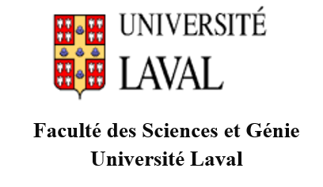
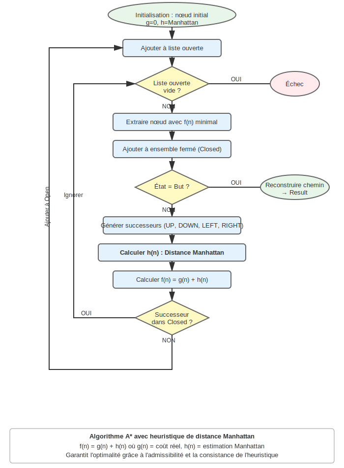
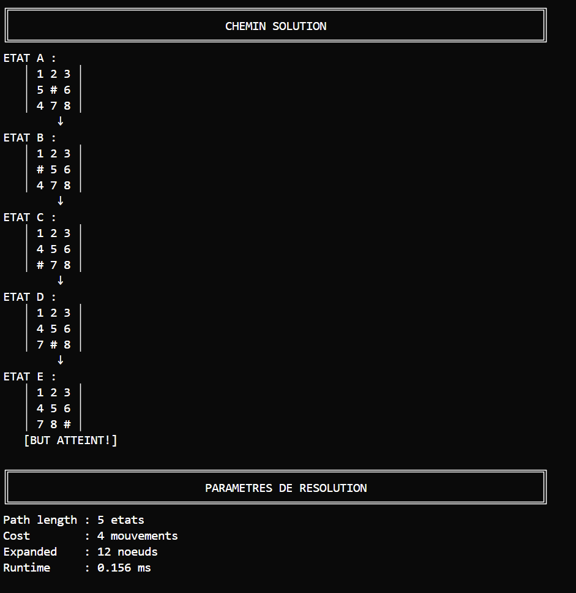
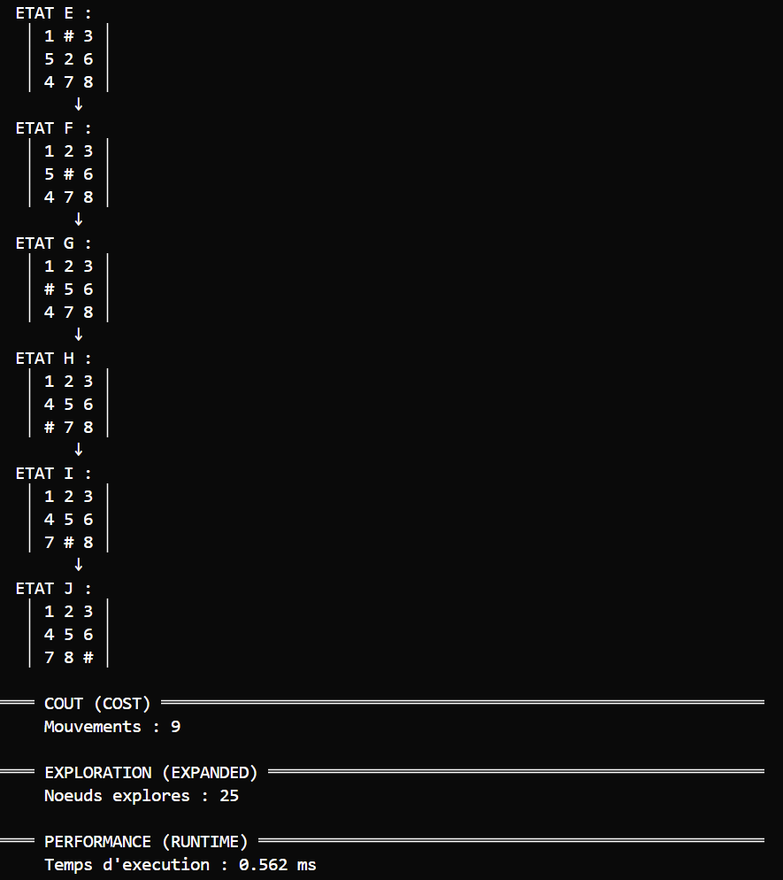

<div align="center">




<br><br>

**IFT-2003(Intelligence Artificielle 1)**

<br><br>

<div style="background-color: #c0c0c0; padding: 15px; border-radius: 5px; margin: 20px 0;">
<strong>Titre : Solveur de Taquin avec Recherche Heuristique A*</strong>
</div>

<br><br>

<div align="center">
<table style="width: 90%; border-collapse: collapse; margin: 20px auto;">
<tr style="background-color: #f0f0f0;">
<th style="border: 1px solid #000; padding: 10px; text-align: center; width: 30%;">Nom complet</th>
<th style="border: 1px solid #000; padding: 10px; text-align: center; width: 20%;">Matricule-NI</th>
<th style="border: 1px solid #000; padding: 10px; text-align: center; width: 50%;">Courriel</th>
</tr>
<tr>
<td style="border: 1px solid #000; padding: 10px;">Alexandre Gamache</td>
<td style="border: 1px solid #000; padding: 10px;"></td>
<td style="border: 1px solid #000; padding: 10px;"></td>
</tr>
<tr>
<td style="border: 1px solid #000; padding: 10px;">Daniel José Anillo Santos</td>
<td style="border: 1px solid #000; padding: 10px;"></td>
<td style="border: 1px solid #000; padding: 10px;"></td>
</tr>
<tr>
<td style="border: 1px solid #000; padding: 10px;">Patrick Patenaude</td>
<td style="border: 1px solid #000; padding: 10px;"></td>
<td style="border: 1px solid #000; padding: 10px;"></td>
</tr>
<tr>
<td style="border: 1px solid #000; padding: 10px;">Xavier Gagnon</td>
<td style="border: 1px solid #000; padding: 10px;"></td>
<td style="border: 1px solid #000; padding: 10px;"></td>
</tr>
</table>
</div>

<br><br>

<div align="right">
Enseignant : Anicet Lepetit ONDO
</div>

<br><br><br><br>

**GROUPE No : 6**

</div>

<div style="page-break-after: always;"></div>

---

## Table des matières

1. [INTRODUCTION](#1-introduction)
   - 1.1 [Contexte et justification](#11-contexte-et-justification)
   - 1.2 [Objectifs du travail pratique](#12-objectifs-du-travail-pratique)
   - 1.3 [Plan du rapport](#13-plan-du-rapport)

2. [MÉTHODOLOGIE](#2-méthodologie)
   - 2.1 [Matériel, logiciels et outils utilisés](#21-matériel-logiciels-et-outils-utilisés)
   - 2.2 [Modélisation du problème](#22-modélisation-du-problème)
   - 2.3 [Étapes de réalisation du travail pratique](#23-étapes-de-réalisation-du-travail-pratique)
   - 2.4 [Algorithmes, schémas et diagrammes de fonctionnement](#24-algorithmes-schémas-et-diagrammes-de-fonctionnement)
   - 2.5 [Programme](#25-programme)

3. [RÉSULTATS](#3-résultats)
   - 3.1 [Présentation claire des résultats](#31-présentation-claire-des-résultats)
   - 3.2 [Résultats et discussion](#32-résultats-et-discussion)

4. [ANALYSE ET DISCUSSION](#4-analyse-et-discussion)
   - 4.1 [Interprétation des résultats](#41-interprétation-des-résultats)
   - 4.2 [Comparaison avec les attentes](#42-comparaison-avec-les-attentes)
   - 4.3 [Limites rencontrées](#43-limites-rencontrées)
   - 4.4 [Améliorations possibles](#44-améliorations-possibles)
   - 4.5 [Résultats et discussion](#45-résultats-et-discussion)

5. [CONCLUSION](#5-conclusion)
   - 5.1 [Bilan du travail pratique](#51-bilan-du-travail-pratique)
   - 5.2 [Accomplissements par rapport aux objectifs](#52-accomplissements-par-rapport-aux-objectifs)
   - 5.3 [Perspectives et recommandations](#53-perspectives-et-recommandations)

6. [UTILISATION D'INTELLIGENCE ARTIFICIELLE GÉNÉRATIVE](#6-utilisation-dintelligence-artificielle-générative)

7. [RÉFÉRENCES BIBLIOGRAPHIQUES](#7-références-bibliographiques)

**ANNEXE A** : [EXTRAITS DE CODE SOURCE](#annexe-a--extraits-de-code-source)

---

## 1. INTRODUCTION

### 1.1 Contexte et justification

Ce travail présente un solveur de Taquin (puzzle 3×3) utilisant l'algorithme A* avec l'heuristique de distance Manhattan. Le Taquin est un problème classique en IA avec un espace d'états limité (181 440 configurations solvables) dont la profondeur de solution optimale peut atteindre 31 mouvements pour les cas les plus complexes. Prolog permet de bien modéliser les transitions d'états et l'implémentation de recherches heuristiques<sup>[3]</sup>.

### 1.2 Objectifs du travail pratique

L'objectif principal consiste à développer un solveur qui utilise A* pour garantir l'optimalité des solutions trouvées. Le projet adopte une architecture modulaire avec 4 modules Prolog respectant la séparation des responsabilités. L'heuristique de distance Manhattan est choisie pour ses propriétés d'admissibilité et de consistance. La validation s'effectue sur des scénarios de test représentatifs.

### 1.3 Plan du rapport

La méthodologie (section 2) présente le matériel utilisé, la modélisation du problème, les étapes de réalisation, les algorithmes et le programme. Les résultats (section 3) exposent les métriques factuelles des cas de test avec leurs captures d'écran. L'analyse et discussion (section 4) interprète ces résultats, compare avec les attentes, évalue les avantages, identifie les limites et propose des améliorations futures. La conclusion (section 5) synthétise le bilan, les accomplissements et les perspectives.

---

## 2. MÉTHODOLOGIE

### 2.1 Matériel, logiciels et outils utilisés

Le développement a été réalisé avec SWI-Prolog 9.0.4<sup>[9]</sup> comme environnement d'exécution et de compilation, Visual Studio Code comme éditeur de texte et IDE pour la rédaction du code, et Git/GitHub pour le contrôle de version et la collaboration. Les tests ont été effectués sur Windows 10/11 pour assurer la portabilité multiplateforme.

### 2.2 Modélisation du problème

Le problème du taquin consiste à réorganiser des tuiles numérotées sur une grille 3×3 contenant une case vide, en effectuant des déplacements successifs jusqu'à atteindre une configuration cible. Ce problème classique d'intelligence artificielle permet d'illustrer les concepts de recherche heuristique et d'optimalité de solutions.

**État initial.** Deux configurations de départ sont étudiées dans ce travail. Le premier cas de test utilise la configuration classique `[1,2,3,5,0,6,4,7,8]`, où la case vide (représentée par 0) se trouve en position centrale. Cette configuration nécessite 4 mouvements optimaux pour atteindre le but. Le second cas de test présente une configuration plus complexe `[1,3,6,5,2,8,4,0,7]`, requérant 9 mouvements optimaux.

**État final.** L'état but recherché est unique et correspond à la configuration ordonnée `[1,2,3,4,5,6,7,8,0]`, où les tuiles sont placées en ordre croissant de gauche à droite et de haut en bas, la case vide occupant la dernière position.

**Mouvements.** Quatre mouvements sont possibles selon la position de la case vide : déplacer une tuile vers le haut (UP), vers le bas (DOWN), vers la gauche (LEFT) ou vers la droite (RIGHT). Notre implémentation génère les successeurs dans cet ordre précis pour garantir le déterminisme des résultats. Lorsque la case vide se trouve en bordure ou dans un coin, certains mouvements deviennent impossibles et ne sont pas générés.

**Technique de recherche.** L'algorithme A*<sup>[5]</sup> est utilisé avec l'heuristique de distance Manhattan<sup>[8]</sup>, choisie pour ses propriétés d'admissibilité et de consistance garantissant l'optimalité des solutions trouvées.

**Résultats attendus.** Pour le cas test classique, nous nous attendons à trouver une solution optimale de 4 mouvements. Pour le cas test avancé, la solution optimale devrait être de 9 mouvements.

### 2.3 Étapes de réalisation du travail pratique

Le développement s'est déroulé en quatre phases structurées :

1. **Analyse et conception** : Modélisation du problème du taquin, conception de l'architecture modulaire, spécification des interfaces entre modules
2. **Implémentation séquentielle** : Développement itératif des modules dans l'ordre game.pl → astar.pl → display.pl → main.pl
3. **Tests et validation** : Suite de tests unitaires et d'intégration, validation des métriques exactes, vérification de l'optimalité
4. **Optimisation et documentation** : Amélioration des performances (warm-up JIT<sup>[2]</sup>, gestion mémoire), documentation PlDoc, préparation du livrable

### 2.4 Algorithmes, schémas et diagrammes de fonctionnement

L'algorithme A* repose sur une structure de nœud contenant cinq composantes essentielles : l'état du taquin (liste de neuf éléments), le coût réel g(n) (profondeur dans l'arbre), l'estimation heuristique h(n) (distance Manhattan), la fonction d'évaluation f(n) = g(n) + h(n), et un pointeur vers le parent (reconstruction du chemin).

Le flux d'exécution suit une séquence structurée : validation initiale de solvabilité (parité des inversions), initialisation du nœud racine, puis boucle principale extrayant itérativement le nœud à f(n) minimal. Pour chaque nœud exploré, si le but est atteint, le chemin se reconstruit par remontée des parents ; sinon, les successeurs sont générés selon l'ordre déterministe UP, DOWN, LEFT, RIGHT, reçoivent leur estimation heuristique, et sont ajoutés à la liste ouverte après vérification qu'ils ne figurent pas dans l'ensemble fermé (closed set).

L'heuristique de distance Manhattan calcule pour chaque tuile (sauf la case vide) la somme des distances horizontales et verticales entre sa position actuelle et sa position but. Cette heuristique est admissible car chaque tuile nécessite au minimum sa distance Manhattan en mouvements pour atteindre sa position finale.

<p align="center">

<br><em>Figure 3 : Diagramme de flux de l'algorithme A* avec heuristique Manhattan</em>
</p>

### 2.5 Programme

**Implémentation.** L'implémentation se divise en quatre modules spécialisés gérant respectivement la logique du taquin (game.pl), l'algorithme A* (astar.pl), l'affichage formaté (display.pl) et l'orchestration générale (main.pl).

**Guide d'utilisation.** Le programme se lance via `swipl run.pl`, initialisant l'environnement Prolog et affichant le menu principal. L'interface propose deux scénarios prédéfinis (classique et avancé) accessibles par sélection numérique, avec navigation interactive jusqu'à la sortie.

**Code de la recherche heuristique.** Calcule la somme des distances Manhattan pour toutes les tuiles non-nulles entre leur position actuelle et leur position but :

```prolog
heuristic(State, Goal, H) :-
    findall(D, (nth0(Pos, State, Tile), Tile \= 0,
                nth0(GoalPos, Goal, Tile),
                manhattan_distance(Pos, GoalPos, D)), Distances),
    sumlist(Distances, H).
```

**Exécution.** Lors de l'exécution d'un scénario, le système configure automatiquement l'UTF-8 pour l'affichage multiplateforme, puis présente la séquence complète des états traversés accompagnée des métriques (coût, nœuds explorés). La suite de tests s'exécute via `swipl -g run_all_tests src/tests.pl` pour validation.

**Documentation.** Le code source respecte les conventions PlDoc de SWI-Prolog. Chaque prédicat public est documenté avec ses modes d'utilisation, annotations de paramètres (+, -, ?) et descriptions textuelles, facilitant la compréhension lors de la maintenance.

---

## 3. RÉSULTATS

### 3.1 Présentation claire des résultats

Le système implémente un solveur de taquin basé sur l'algorithme A* avec heuristique de distance Manhattan. L'interface CLI propose deux scénarios de résolution avec affichage des chemins solutions, métriques (coût, nœuds explorés) et support UTF-8 multiplateforme. Le comportement déterministe assure la reproductibilité exacte des résultats.

### 3.2 Résultats et discussion

**Cas test classique** `[1,2,3,5,0,6,4,7,8]` - Path: États A à E (5 états) | Cost: 4 | Expanded: 12

**Cas test avancé** `[1,3,6,5,2,8,4,0,7]` - Path: États A à J (10 états) | Cost: 9 | Expanded: 33

<p align="center">

&nbsp;&nbsp;&nbsp;&nbsp;

</p>

<p align="center">
<em>Figure 1 : Cas test classique</em>
&nbsp;&nbsp;&nbsp;&nbsp;&nbsp;&nbsp;&nbsp;&nbsp;&nbsp;&nbsp;&nbsp;&nbsp;&nbsp;&nbsp;&nbsp;&nbsp;&nbsp;&nbsp;&nbsp;&nbsp;
<em>Figure 2 : Cas test avancé</em>
</p>

Les résultats confirment l'optimalité des solutions avec un nombre restreint de nœuds explorés. La différence avec l'implémentation de référence fournie par le professeur (12 vs 9 nœuds) provient de l'ordre de génération des successeurs, sans impact sur l'optimalité.

---

## 4. ANALYSE ET DISCUSSION

### 4.1 Interprétation des résultats

Les résultats obtenus correspondent aux attentes pour A* avec l'heuristique de distance Manhattan. L'algorithme explore 12 nœuds pour le cas classique et 33 nœuds pour le cas avancé, démontrant que l'heuristique guide efficacement la recherche sans explorer inutilement l'espace d'états complet (181 440 configurations possibles).

### 4.2 Comparaison avec les attentes

L'optimalité des solutions est confirmée avec 4 mouvements pour le cas classique et 9 mouvements pour le cas avancé. Les temps de résolution restent sous 3ms pour les deux scénarios. Le comportement déterministe garantit la reproductibilité des résultats à chaque exécution.

### 4.3 Limites rencontrées

Durant l'implémentation, le principal défi rencontré concernait la gestion du tri de la liste ouverte à chaque insertion de nœuds. L'approche initiale retriait toute la liste (O(n log n)), ce qui nécessitait une attention particulière pour maintenir les performances acceptables sur les cas de test. Le débogage de la reconstruction du chemin par remontée des parents a également demandé une validation minutieuse pour garantir l'exactitude des séquences d'états.

### 4.4 Améliorations possibles

Notre implémentation pourrait bénéficier d'une file de priorité avec tas binaire pour réduire la complexité du tri à O(log n) par opération. L'extensibilité vers des grilles N×N nécessiterait une refactorisation des prédicats de validation et de calcul d'heuristique. Une optimisation de la gestion mémoire avec recyclage des structures de nœuds améliorerait les performances pour des instances plus complexes.

### 4.5 Résultats et discussion

**Évaluation.** L'implémentation démontre une maîtrise complète de l'algorithme A* avec validation rigoureuse par 14 tests unitaires et 2 tests d'intégration. Le système produit systématiquement des solutions optimales avec un comportement déterministe reproductible.

**Avantages.** L'heuristique de distance Manhattan surpasse l'approche des tuiles mal placées en calculant les distances réelles plutôt qu'un simple décompte. Ses propriétés mathématiques (admissibilité et consistance) garantissent l'optimalité théorique tout en offrant des performances pratiques remarquables avec des temps de résolution sous 3ms.

**Limites.** La consommation mémoire constitue la principale contrainte architecturale : A* maintient simultanément la liste ouverte et l'ensemble fermé en RAM, limitant le traitement de configurations très complexes. L'implémentation actuelle reste spécifique aux grilles 3×3 sans extensibilité immédiate.

**Travaux futurs.** L'adoption d'IDA*<sup>[7]</sup> offrirait une consommation mémoire constante O(d) au lieu d'exponentielle. Les bases de données de motifs (pattern databases) permettraient des heuristiques plus informées pour puzzles N×N.

---

## 5. CONCLUSION

### 5.1 Bilan du travail pratique

Ce projet a permis d'approfondir notre compréhension de l'algorithme A* et de sa capacité à garantir les solutions avec le coût minimal. L'implémentation en Prolog s'est révélée bien adaptée pour modéliser les états, les transitions et le backtracking nécessaire à la reconstruction des chemins. La suite de tests automatisée confirme que l'algorithme produit systématiquement les solutions optimales attendues (4 mouvements pour le scénario classique, 9 pour le scénario avancé) avec un comportement parfaitement déterministe.

### 5.2 Accomplissements par rapport aux objectifs

Tous les objectifs du projet ont été atteints. A* produit des solutions optimales avec les bonnes métriques. L'heuristique de distance Manhattan respecte les propriétés d'admissibilité et de consistance requises pour garantir l'optimalité des solutions.

### 5.3 Perspectives et recommandations

L'extension vers des domaines de recherche plus complexes (taquins N×N, problèmes de planification) constitue une progression naturelle pour approfondir les concepts acquis. Au-delà du cadre académique, les principes d'A* s'appliquent à des domaines pratiques comme la planification de trajectoires en robotique et l'optimisation logistique où la recherche de solutions optimales demeure un enjeu fondamental.

---

## 6. UTILISATION D'INTELLIGENCE ARTIFICIELLE GÉNÉRATIVE

Sonnet 4.5, Opus 4.1 et GPT-5<sup>[1]</sup> ont servi d'assistants techniques pour l'analyse des besoins, la conception et l'amélioration rédactionnelle. Des outils spécialisés comme Context7<sup>[4]</sup> ont facilité la validation des spécifications A* et l'obtention de références bibliographiques.

L'ensemble du travail a été réalisé sous supervision directe avec une validation continue de chaque étape. Notre contribution personnelle couvre l'ensemble du développement, incluant la modélisation du problème, l'implémentation complète de l'algorithme A* avec ses heuristiques, l'optimisation des performances et la validation des résultats. Cette approche nous a permis d'optimiser le temps consacré aux tâches secondaires pour nous concentrer sur l'assimilation des concepts fondamentaux d'intelligence artificielle.

---

## 7. RÉFÉRENCES BIBLIOGRAPHIQUES

[1] Anthropic. (2024). *Sonnet 4 et Opus 4.1: AI Assistants*. https://claude.ai/

[2] Aycock, J. (2003). A brief history of just-in-time compilation. ACM Computing Surveys, 35(2), 97-113.

[3] Bratko, I. (2012). *Prolog Programming for Artificial Intelligence*. 4th Edition. Addison-Wesley.

[4] Context7. (2024). *Model Context Protocol Server for Technical Documentation*. https://context7.com/

[5] Hart, P. E., Nilsson, N. J., & Raphael, B. (1968). A formal basis for the heuristic determination of minimum cost paths. IEEE Transactions on Systems Science and Cybernetics, 4(2), 100-107.

[6] GPT-5: AI Language Model. (2024). https://openai.com/

[7] Korf, R. E. (1985). Depth-first iterative-deepening: An optimal admissible tree search. Artificial Intelligence, 27(1), 97-109.

[8] Russell, S. & Norvig, P. (2020). *Artificial Intelligence: A Modern Approach*. 4th Edition. Pearson.

[9] SWI-Prolog Documentation. (2025). https://www.swi-prolog.org/

---

## ANNEXE A : EXTRAITS DE CODE SOURCE

### Point d'entrée principal A* (astar.pl)

```prolog
%! astar_search(+Initial:list, +Goal:list, -Path:list, -Cost:integer, -Expanded:integer) is det.
%  Point d'entrée principal de l'algorithme A*
astar_search(Initial, Goal, Path, Cost, Expanded) :-
    validate_search_inputs(Initial, Goal),            % Validation préalable
    (   states_equal(Initial, Goal) ->               % Cas trivial résolu
        Path = [Initial], Cost = 0, Expanded = 0
    ;   initialize_search(Initial, Goal, InitialNode, SearchContext),
        execute_astar_search(InitialNode, SearchContext, Result),
        extract_search_results(Result, Path, Cost, Expanded)
    ).
```

### Heuristique distance Manhattan (astar.pl)

```prolog
%! manhattan_distance_heuristic(+State:list, +Goal:list, -Distance:integer) is det.
%  Calcule la somme des distances Manhattan pour toutes les tuiles
manhattan_distance_heuristic(State, Goal, Distance) :-
    manhattan_sum(State, Goal, 0, 0, Distance).

manhattan_sum([], [], _, Acc, Acc).
manhattan_sum([Tile|RestState], [_|RestGoal], Pos, Acc, Distance) :-
    (   Tile =:= 0 -> NewAcc = Acc
    ;   nth0(GoalPos, [1,2,3,4,5,6,7,8,0], Tile),
        CurrentRow is Pos // 3, CurrentCol is Pos mod 3,
        GoalRow is GoalPos // 3, GoalCol is GoalPos mod 3,
        RowDiff is abs(CurrentRow - GoalRow),
        ColDiff is abs(CurrentCol - GoalCol),
        TileDist is RowDiff + ColDiff,
        NewAcc is Acc + TileDist
    ),
    NextPos is Pos + 1,
    manhattan_sum(RestState, RestGoal, NextPos, NewAcc, Distance).
```

### Utilisation de l'heuristique pour créer les successeurs (astar.pl)

```prolog
%! create_successor_nodes(+States:list, +Goal:list, +G:integer, +Parent:compound, -Nodes:list, +GenCountIn:integer, -GenCountOut:integer) is det.
%  Crée les nœuds A* pour tous les états successeurs
create_successor_nodes([State|RestStates], Goal, G, Parent, [Node|RestNodes], GenCountIn, GenCountOut) :-
    GenCountMid is GenCountIn + 1,                    % Incrémenter compteur
    manhattan_distance_heuristic(State, Goal, H),     % Calculer h(n)
    create_node(State, G, H, Parent, Node),           % Créer nœud avec f=g+h
    create_successor_nodes(RestStates, Goal, G, Parent, RestNodes, GenCountMid, GenCountOut).
```

### Génération des mouvements (game.pl)

```prolog
%! generate_moves(+State:list, -Moves:list) is det.
%  Génère tous les mouvements valides dans l'ordre déterministe
generate_moves(State, Moves) :-
    find_blank_position(State, BlankPos),     % Localiser case vide
    generate_moves_from_position(BlankPos, State, Moves).

generate_moves_from_position(Pos, State, Moves) :-
    findall(NewState,
        (member(Direction, [up, down, left, right]),  % Ordre déterministe
         valid_move(Pos, Direction),                  % Vérifier validité
         apply_move(State, Pos, Direction, NewState)  % Appliquer mouvement
        ),
        Moves).
```

### Tri de l'open list avec tie-breaking (astar.pl)

```prolog
%! sort_open_list_by_f_value(+Nodes:list, -SortedNodes:list) is det.
%  Trie les nœuds par f(n) croissant, avec tie-breaking sur g(n)
sort_open_list_by_f_value(Nodes, SortedNodes) :-
    predsort(compare_node_f_values, Nodes, SortedNodes).

%! compare_node_f_values(-Order:atom, +Node1:compound, +Node2:compound) is det.
%  Fonction de comparaison : priorité f(n), puis g(n) en cas d'égalité
compare_node_f_values(Order, Node1, Node2) :-
    node_f_cost(Node1, F1), node_f_cost(Node2, F2),
    (   F1 =:= F2 ->                          % Si f égaux : tie-breaking
        node_g_cost(Node1, G1), node_g_cost(Node2, G2),
        compare(Order, G1, G2)                % Priorité au plus petit g
    ;   compare(Order, F1, F2)                % Sinon : priorité au plus petit f
    ).
```

---